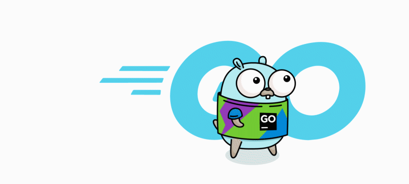

<div align="center">


# 🚀 Golang Projects

### 🐹 Go Developer Formation Journey

A collection of personal projects built with **Go (Golang)** during my learning journey through the **Go Developer Formation** by **DIO (Digital Innovation One)**.

<p>
  
  
  
</p>

</div>

---

## 📖 About This Repository

This repository contains projects developed throughout my participation in the **Go Developer Formation** offered by **DIO.me**.

The goal is to document my progress and practical experience while learning Go, applying concepts through challenges, exercises, and real-world projects.

---

## 🎓 Go Developer Formation

I am currently enrolled in the **Go Developer Formation** at **DIO.me**, focusing on:

* Go Fundamentals
* APIs and Web Services
* Concurrency with Goroutines & Channels
* Database Integration
* Clean Code
* Software Architecture
* Backend Development Best Practices

Each project in this repository represents a step forward in my journey as a Go developer.

---

## 🎯 Objectives

* Strengthen my Go programming skills
* Build practical applications
* Apply software engineering principles
* Develop real-world backend solutions
* Create a professional portfolio

---

## 🛠️ Technologies

* Go (Golang)
* REST APIs
* JSON
* HTTP
* Databases
* Goroutines
* Channels
* Clean Code
* Software Architecture

---

## 📈 Progress

```text
[██████████░░░░░░░░░░] Go Developer Formation in Progress 🚀
```

---

## 🌟 Repository Purpose

This repository serves as a practical learning space where I can apply and reinforce the knowledge acquired throughout the **Go Developer Formation by DIO.me**.

I am continuously expanding this collection with new projects as I advance through the program.

---

<div align="center">

### 💡 "The best way to learn Go is by building real projects."



⭐ Thank you for visiting my repository!

</div>
